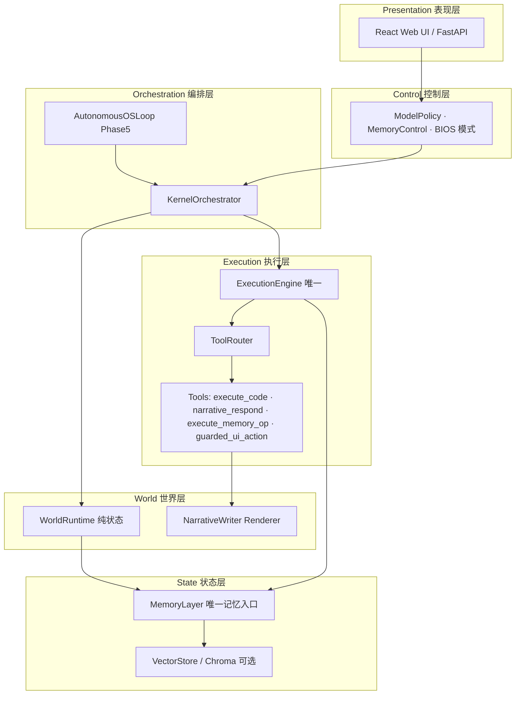
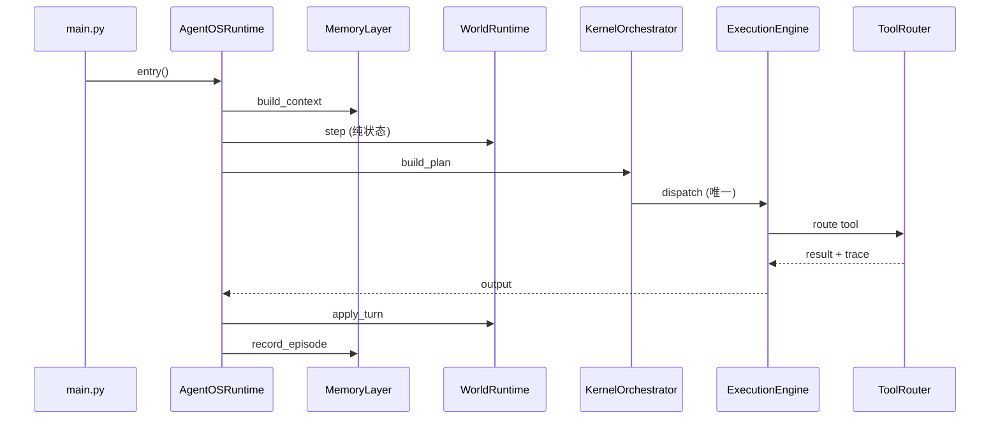
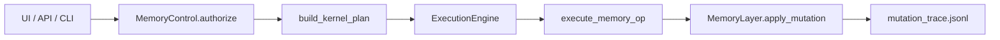
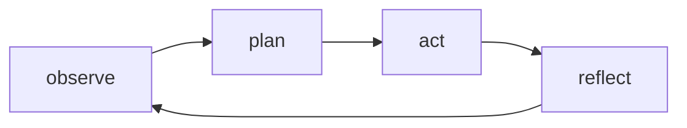
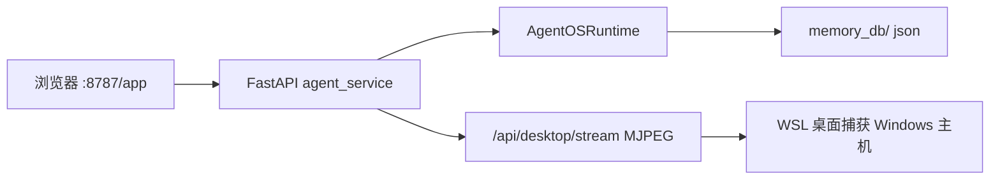

# Memory Agent OS — 架构图（Mermaid）

> 可在 VS Code / GitHub 预览；运行 `python3 scripts/generate_portfolio_docs.py` 生成 PNG 并写入 docx。

## 1. 六层工程架构

## 2. 唯一执行路径（内核）

## 3. 记忆治理写入路径

## 4. Phase 5 自主闭环

每步 `AutonomousOSLoop` 仅调用 `AgentOSRuntime.entry()`，禁止第二 ExecutionEngine。

## 5. 部署与演示数据流

